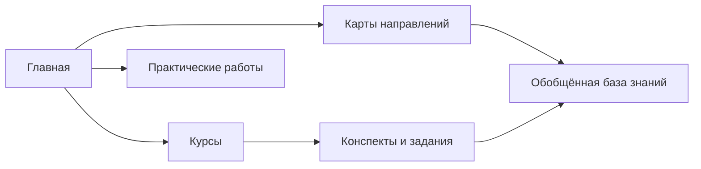

# База знаний IT-специалиста и специалиста по информационной безопасности

Персональная база знаний Кирилла Иванова: учебные конспекты, практические работы и систематизированные материалы по информационной безопасности, компьютерным сетям, программированию и администрированию.

## Цели репозитория

- сохранять и связывать знания из курсов и практики;
- переводить учебный материал в применимые профессиональные заметки;
- фиксировать ход лабораторных работ и собственные выводы;
- поддерживать понятную карту развития навыков.

## Основные направления

- информационная безопасность и противодействие кибератакам;
- компьютерные сети и сетевая сегментация;
- SIEM, системные события и анализ журналов;
- Python для задач информационной безопасности;
- SQL и базы данных;
- программирование в 1С;
- системное администрирование.

## Структура

- `00 — Навигация` — главная страница, карты направлений и содержание курсов;
- `10 — База знаний` — краткие обобщённые заметки по понятиям и технологиям;
- исходные папки курсов — конспекты, задания и лабораторные работы;
- `99 — Шаблоны` — единые шаблоны заметок;
- `АРХИВ...` — завершённые и неактуальные курсы, сохранённые как источники.

## Навигация

- [Главная страница базы](00%20%E2%80%94%20Навигация/Главная.md)
- [Карта базы знаний](00%20%E2%80%94%20Навигация/Карта%20базы%20знаний.md)
- [Информационная безопасность](00%20%E2%80%94%20Навигация/Информационная%20безопасность.md)
- [Компьютерные сети](00%20%E2%80%94%20Навигация/Компьютерные%20сети.md)
- [Практические и лабораторные работы](00%20%E2%80%94%20Навигация/Практические%20и%20лабораторные%20работы.md)

## Технологии и инструменты

В материалах встречаются Obsidian, Python, SQL, 1С, Linux, Cisco Packet Tracer, IPTables, Sysmon, Auditd, Osquery, Elasticsearch, Kibana, WAF, NGFW и IDS/IPS. Наличие заметки означает изучение темы и не заявляет сертификацию или производственный опыт.

## Типы материалов

- теория и определения;
- курсовые конспекты;
- практические и лабораторные работы;
- команды и конфигурационные примеры;
- обобщённые профессиональные заметки;
- учебные проекты и кейсы.

## Принципы ведения

1. Исходный контекст курса сохраняется.
2. Обобщённые заметки ссылаются на первичные конспекты без их полного копирования.
3. Практические материалы содержат цель, ход работы, проверку и вывод.
4. Реальные секреты, персональные данные и закрытая рабочая информация не публикуются.
5. База развивается постепенно; отдельные разделы могут быть незавершёнными.

## Использование в Obsidian

Откройте каталог репозитория как хранилище Obsidian и начните с файла `00 — Навигация/Главная.md`. Внутренняя навигация использует wikilinks, а README содержит обычные Markdown-ссылки для GitHub.

## Конфиденциальность

Рабочая и проектная документация может храниться отдельно и не включается в публичную навигацию репозитория. Перед публикацией материалы проходят проверку на секреты, персональные данные и внутренние адреса.

## Автор

Кирилл Иванов.
